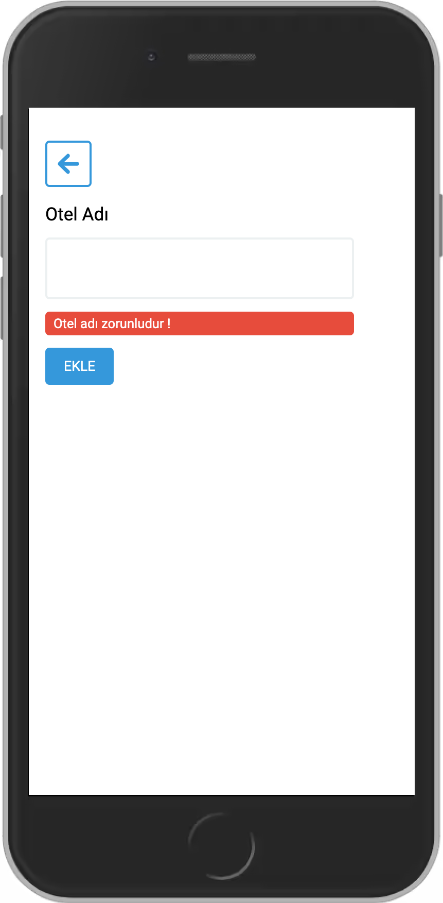

### Etstur Case Study

Kullanıcıların otel görüntüleme, otel puanlarına göre sıralama, otel ekleme ve çıkarma işlemlerini yapabildiği bir React uygulaması.

#### Front-End Developer Çalışması Genel Kriterler:

<ul>
    <li>Çalışma Single Page Application olmalıdır.</li>
    <li>React kullanımı bir artı olacaktır.</li>
    <li>Çalışma içinde yapılacak save / load işlemleri için Local Storage kullanılmalıdır</li>
    <li>Çalışmayı tamamlamak için istenilen CSS Framework’ünden yararlanılabilinir, ya da aday, çizimleri referans alarak kendi stil dosyasını oluşturabilir.</li>
    <li>Yapılacak çalışma en az 2 ayrı sayfa içermelidir.</li>
    <li>Liste sayfası</li>
    <li>Otel ekleme sayfası</li>
</ul>

#### Front-End Developer Çalışması Genel Kriterler:

<ul>
    <li>Uygulama, kullanıcıyı liste ekranı ile karşılamalıdır. Sayfa ilk yüklendiğinde
oteller en son girilen kayıt en üste çıkmalı kuralına göre listelenmelidir.</li>
    <li>Puan Artır butonu ilgili otelin puanı 1 puan arttırılmalı, Puanı azalt butonu ile
otel puanını 1 puan azaltmalıdır. Son haldeki otel puanına göre otelin sırası
değişmelidir. Puanı aynı olan otellerin sıralama kriteri en son oy kullanılan en
üstte gözükecek kuralına göre olmalıdır.</li>
    <li> Otelleri puana göre artan azalan seçimine göre sıralanabilmelidir</li>
    <li> Liste sayfasında otel sayısı 5’den fazlaysa pagination ile sayfalara bölünmeli, 5’er
5’er sayfalanmalıdır.</li>
    <li> Liste sayfasında, otel üzerine mouse ile gelindiğinde, otel kartı highlight
edilmeli ve sağ üst köşesinde sil butonu belirmelidir.</li>
    <li>Sil butonuna basıldığında kullanıcıya oteli silmek isteyip istemediğini soran bir
dialog ekrana gelir. Kullanıcı OK derse, Yeşil bir uyarı çizimlerde görüldüğü gibi
ekranda belirir.</li>
    <li>Yeni otel ekleme formunda, eğer link başarılı şekilde kaydedilirse, Çizimlerde
görüldüğü gibi yeşil buton ve uyarı mesajı ekranda belirir.</li>
</ul>

#### Kullanılan Teknolojiler

- React
- React Router Dom
- React Icons
- React Confirm Alert
- Node Sass
- Moment

#### Ekran Görüntüleri

<table>
  <tr>
    <td valign="top">
        
    </td>
     <td valign="top">
       
    </td>
     <td valign="top">
       
    </td>
  </tr>
   <tr>
    <td valign="top">
        
    </td>
     <td valign="top">
       
    </td>
     <td valign="top">
       
    </td>
  </tr>
</table>